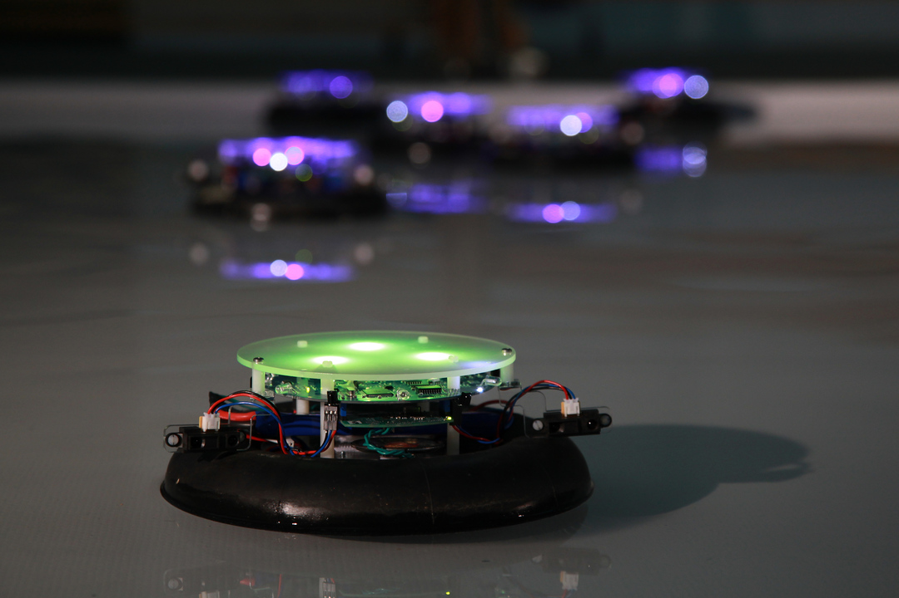

# Vessels
*Par Sofian Audry, Stephen Kelly et Samuel St-Aubin en collaboration avec Adam Kelly*

**En partenariat avec:**
Le Centre for Art Tapes et Perte de Signal.

**Sponsorisé par:**
Le conseil des arts du Canada, le conseil des arts et des lettres du Québec, le ministère de la Culture, du patrimoine et du tourisme de la Nouvelle-Écosse et la municipalité régionale d'Halifax.

## Les dates importantes et lieux d'expositions

**En 2010:** le premier prototype entièrement fonctionnel d'un vessel est créé ainsi qu'une présentation au festival Nocturne Halifax.  
**En 2015:** une exposition à Montréal au Eastern Bloc ainsi qu'une exposition à l'Ososphère à Strasbourg en France.  
**En 2016:** au festival Montréal en Lumière, à l'hôtel de ville.  
**En 2018:** à ROBOTANICA: The New Wilderness, Amsterdam, aux Pays-Bas ainsi qu'à la Gaîté Lyrique à l'exposition capitaine futur et la supernature à Paris, France.  
**En 2024:** au Village Numérique de Mutek à Montréal.

## L'oeuvre

 
 
Vessels est une installation qui comprend plusieurs petits robots aquatiques avec leurs propres personnalités qui communiquent entre eux pour développer La façon dont ils agissent. Les aspects qui peuvent affecter leurs personnalités sont la température, la qualité de l'eau et de l'air, la pression atmosphérique, la lumiere et le son ainsi que le comportement des autres robots.
 
 
Les robots agissent comme des créatures sociales avec lesquelles les personnes de tous les ages peuvent sympathiser, mais le fait qu'ils vivent dans l'eau, un environnement qui peut entraîner leur destruction, reflète nos insécurités au sein de notre monde.
 
 
Des capteurs de proximité infrarouge sont placés aux alentours des robots pour qu'ils puissent interagir entre eux. Ils peuvent naviguer dans leur environnement grâce à des pompes qui les propulsent. Des lumières DEL permettent au robot de montrer leurs personnalités et réactions. 10 à 50 robots sont utilisés par exposition.
 
 

## Ce qui définit l'oeuvre et mon appréciation

L'élément clé qui rend l'oeuvre si intéressant est la capacité des robots à développer leurs personnalités grâce à leurs interactions. Grâce à cette composante, les spectateurs peuvent sympathiser avec ces machines et même les voir créer des petites histoires avec leurs interactions, un aspect difficile à trouver parmi la vaste majorité des installations multimédia. Sans les personnalités des robots, l'exposition serait juste une présentation de DEL flottant sur de l'eau, c'est beau à voir mais rien de spécial.
 
 
J'adore Vessels, permettre à des robots d'interagir entre eux et leurs environnements afin de développer leur caractère est une idée unique et attirante car elle nous permet de sympathiser avec des objets artificiels qui vivent dans un milieu dangereux ainsi que de créer nos propres histoires les regardant socialiser.